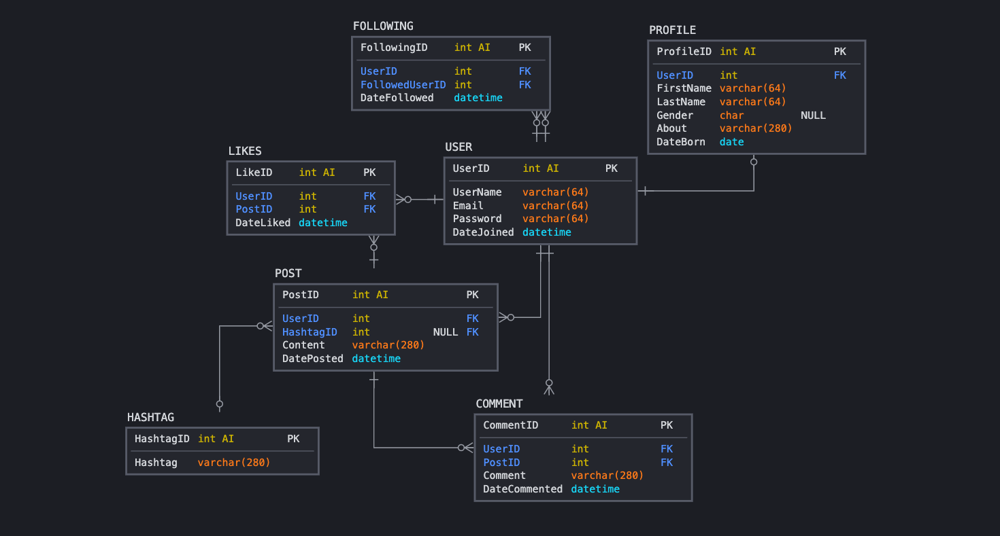

# CS370 Project

### Team
* Evan Wieland
* Samuel Carpenter
* Jason Marks
* Nick Albrecht

### SoW
Located at [sow.pdf](sow.pdf)

### LDM

### SQL
#### DDL for creating db & tables
Located at [sql/spawn.sql](sql/spawn.sql)

#### DDL for dropping db & tables
Located at [sql/destroy.sql](sql/destroy.sql)

#### DDL for creating db from backup
Located at [sql/db.sql](sql/db.sql)

#### Creating the DB WITH data
`$ mysql -u root -p < /<ABSOLUTE_PATH>/chati/sql/db.sql`

#### Creating the DB WITHOUT data
`$ mysql -u root -p < /<ABSOLUTE_PATH>/chati/sql/spawn.sql`

#### Destroying the DB
`$ mysql -u root -p < /<ABSOLUTE_PATH>/chati/sql/destroy.sql`

### Data
Located at [data/sanitized/](data/sanitized/)

### Queries
Located at [sql/example_queries.sql](sql/example_queries.sql)
